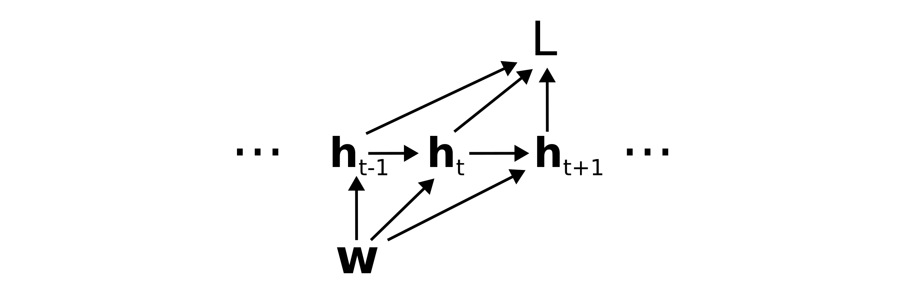
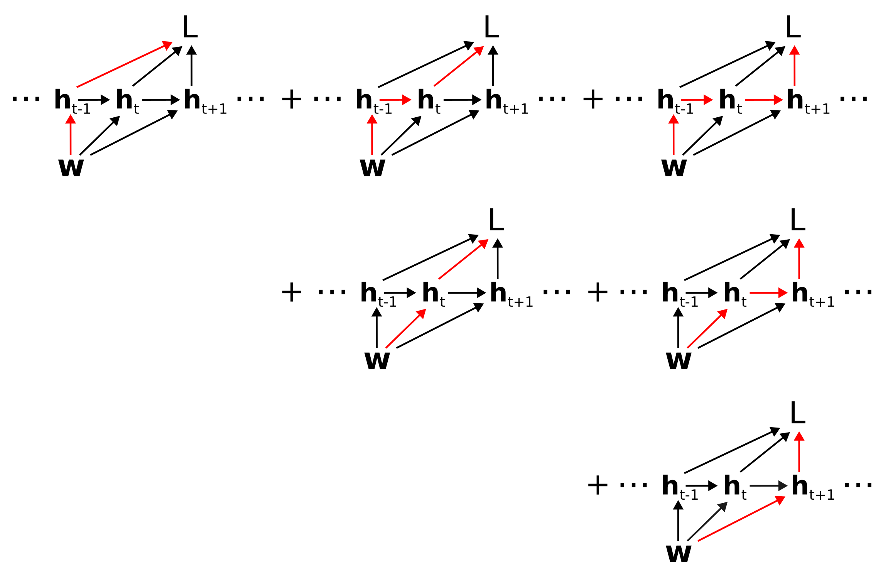

# The classical factorization of back-propagation through time
**Rich Pang**

2025-10-29

A graphical derivation of the "classical factorization" of the loss gradient in back-propagation through time, as defined in [Bellec et al 2020](https://www.nature.com/articles/s41467-020-17236-y) (Eq. 15).

Recommended preliminary reading: <a href="/blog/2025/partial_and_total_derivatives_on_computation_graphs.html">Partial and total derivatives on computation graphs</a>.

## Back-propagation through time

Back-propagation through time is the classic extension of back-propagation to recurrent neural networks (RNNs).
In its most general form, an RNN parameterized by weights $\mathbf{w}$ (for simplicity we ignore biases here) has a hidden state $\mathbf{h}_t$ that evolves over time in response to inputs $\mathbf{u}_t$.

$$
\mathbf{h}_t = \mathbf{h}_t(\mathbf{h}_{t-1}, \mathbf{u}_t; \mathbf{w}).
$$

Typically, the loss is a function of the hidden states:

$$
L = L(\{\mathbf{h}_t\}).
$$

Treating the inputs as constant, the weights $\mathbf{w}$ determine the loss through the following computation graph:

## Counting paths on the computation graph

To determine the total derivative $dL/d\mathbf{w}$ of the loss with respect to the weights, we need to sum over all paths from $\mathbf{w}$ to $L$, where we recall that a path corresponds to the product of Jacobians $\mathcal{D}_{\alpha\beta}$ backwards along the path.
To arrive at the classical factorization we group paths according to the first edge out of $\mathbf{w}$. That is, we take $dL/d\mathbf{w} = $

which corresponds to $\frac{dL}{d\mathbf{w}} = $

$$
\dots + \left(
\mathcal{D}_{L\mathbf{h}_{t-1}}
+ \mathcal{D}_{L\mathbf{h}_t}\mathcal{D}_{\mathbf{h}_t\mathbf{h}_{t-1}}
+ \mathcal{D}_{L\mathbf{h}_{t+1}}\mathcal{D}_{\mathbf{h}_{t+1}\mathbf{h}_{t}}\mathcal{D}_{\mathbf{h}_t\mathbf{h}_{t-1}}
+ \dots
\right) \mathcal{D}_{\mathbf{h}_{t-1}\mathbf{w}}
+ \dots
$$

$$
\dots + \left(
\mathcal{D}_{L\mathbf{h}_t}
+ \mathcal{D}_{L\mathbf{h}_{t+1}}\mathcal{D}_{\mathbf{h}_{t+1}\mathbf{h}_t}
+ \mathcal{D}_{L\mathbf{h}_{t+2}}\mathcal{D}_{\mathbf{h}_{t+2}\mathbf{h}_{t+1}}\mathcal{D}_{\mathbf{h}_{t+1}\mathbf{h}_t}
+ \dots
\right) \mathcal{D}_{\mathbf{h}_t\mathbf{w}}
+ \dots
$$

$$
\dots + \left(
\mathcal{D}_{L\mathbf{h}_{t+1}}
+ \mathcal{D}_{L\mathbf{h}_{t+2}}\mathcal{D}_{\mathbf{h}_{t+2}\mathbf{h}_{t+1}}
+ \mathcal{D}_{L\mathbf{h}_{t+3}}\mathcal{D}_{\mathbf{h}_{t+3}\mathbf{h}_{t+2}}\mathcal{D}_{\mathbf{h}_{t+2}\mathbf{h}_{t+1}}
+ \dots
\right) \mathcal{D}_{\mathbf{h}_{t+1}\mathbf{w}}
+ \dots
$$

Now notice that the term in parentheses in each row is simply the total derivative of the loss with respect to the hidden state.

In other words,

$$
\frac{dL}{d\mathbf{w}} = \dots + \frac{dL}{d\mathbf{h}_{t-1}} \mathcal{D}_{\mathbf{h}_{t-1}\mathbf{w}}
+ \frac{dL}{d\mathbf{h}_t} \mathcal{D}_{\mathbf{h}_t\mathbf{w}}
+ \frac{dL}{d\mathbf{h}_{t+1}} \mathcal{D}_{\mathbf{h}_{t+1}\mathbf{w}}
+ \dots
$$

or

$$
\frac{dL}{d\mathbf{w}} = \sum_t \frac{dL}{d\mathbf{h}_t} \frac{\partial \mathbf{h}_t}{\partial \mathbf{w}}
$$

where we have used $\partial\mathbf{h}_t/\partial \mathbf{w} \equiv \mathcal{D}_{\mathbf{h}_t \mathbf{w}}$.

This recovers the classical factorization of the BPTT loss gradient described in Eq. 15 of Bellec et al 2020.
Note that for simplicity we have ignored the neuron indices.
However, these can be included in a straightforward manner following the same logic as in the derivation above (exercise for the reader).

*Special thanks to Helena Liu for proofreading this post.*