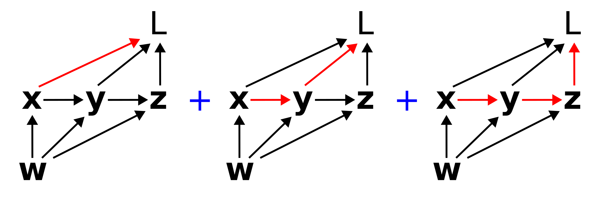

# Partial and total derivatives on computation graphs
**Rich Pang**

2025-10-22

Some clarifications about derivatives on computation graphs. This extends Christopher Olah's excellent [post](https://colah.github.io/posts/2015-08-Backprop/) about this topic and is meant to help make sense of different factorizations of loss gradients, e.g. in the *e-prop* algorithm of [Bellec et al 2020](https://www.nature.com/articles/s41467-020-17236-y).

## Partial derivatives and Jacobians

The *partial derivative* describes how a function changes with respect to one of its arguments.
A crucial observation is that the partial derivative depends on how the functions in question are specified.
For instance, consider case 1 where we write
$$z = x^2 + y^2$$
$$L = z^2 + x^2$$
vs case 2 where we write
$$L = 2x^2 + y^2,$$

which describe the same relationship between $L$ and $x$.
However, in case 1 
$$\frac{\partial L}{\partial x} = 2x$$
whereas in case 2
$$\frac{\partial L}{\partial x} = 4x.$$
Thus when talking about the partial derivative of one variable computed through a series of intermediate steps from several other variables, one needs to be precise about what those intermediate steps are.

The *Jacobian* of a function, specifically a vector-valued function of multiple arguments, is the matrix of partial derivatives of each component of the function value with respect to each argument.
For instance, suppose

$$\mathbf{y} = \mathbf{y}(\mathbf{x})$$

where $\mathbf{x} \in \mathbb{R}^n$ and $\mathbf{y} \in \mathbb{R}^m$. 
Then the Jacobian $\mathcal{D}_{\mathbf{y}\mathbf{x}}$ is

$$
\mathcal{D}_{\mathbf{y}\mathbf{x}} = 
\begin{bmatrix}
\dfrac{\partial y_1}{\partial x_1} & \cdots & \dfrac{\partial y_1}{\partial x_n} \\
\vdots & \ddots & \vdots \\
\dfrac{\partial y_m}{\partial x_1} & \cdots & \dfrac{\partial y_m}{\partial x_n}
\end{bmatrix}
$$

## Paths on computation graphs

Computation graphs are visual representations of a series of steps used to compute a function value.
For instance, consider a loss function $L$ that depends on weights $w$ in the following way:

$$\mathbf{x} = \mathbf{x}(\mathbf{w})$$

$$\mathbf{y} = \mathbf{y}(\mathbf{x}, \mathbf{w})$$

$$\mathbf{z} = \mathbf{z}(\mathbf{y}, \mathbf{w})$$

$$L = L(\mathbf{x}, \mathbf{y}, \mathbf{z}).$$

This series of functions and dependencies can be represented via the following directed acyclic graph.

Computation graphs are a fundamental abstraction in modern machine learning and AI, and understanding them comprehensively is fundamental to understanding how core libraries like PyTorch compute gradients.

Paths on computation graphs are of frequent interest.
Mathematically, a path corresponds to a product of Jacobians backwards along that path.
For instance, when we speak of the path from $\mathbf{w}$ to $\mathbf{y}$ to $L$, we are referring to is

$$
\mathcal{D}_{L\mathbf{y}} \mathcal{D}_{\mathbf{y} \mathbf{w}}.
$$

The path conveys the flow of information from the source variable, $\mathbf{w}$ to the target variable $L$. 
Such a picture is very useful for intuiting about e.g. vanishing gradients.
A long path, for instance, often corresponds to a large number of Jacobians with eigenvalues less than 1, which when multiplied together will cause their product to vanish.
This means that a small change in the source variable will lead to no change in the target variable, at least through that particular path.

## Total derivatives

The total derivative of a target variable, e.g. $L$, with respect to a source variable, e.g. $\mathbf{x}$, specifies how a small change in $\mathbf{x}$ leads to a small change in $L$ through all possible ways that $\mathbf{x}$ can influence $L$.
On the computation graph, the total derivative of $dL/d\mathbf{x}$ corresponds to the sum of all (directed) paths from $\mathbf{x}$ to $L$.
For instance, on the graph above, $dL/d\mathbf{x}$ corresponds to the sum of the following three paths:

Not that the paths can overlap, e.g. multiple paths can include the same edge (link). Mathematically, this sum corresponds to

$$
\frac{dL}{d\mathbf{x}} = 
\mathcal{D}_{L\mathbf{x}}
+ \mathcal{D}_{L\mathbf{y}}\mathcal{D}_{\mathbf{y}\mathbf{x}}
+ \mathcal{D}_{L\mathbf{z}}\mathcal{D}_{\mathbf{z}\mathbf{y}}\mathcal{D}_{\mathbf{y}\mathbf{x}}.
$$

Similarly $dL/d\mathbf{w}$ would correspond to the sum of all six paths from $\mathbf{w}$ to $L$.

## Factorizing paths

Summing over paths can be a tricky combinatorics problem, and it can be useful to think about different ways to factorize the sum.
The key point is to look for common terms.
For instance, the sum

$$
\frac{dL}{d\mathbf{w}} 
= \mathcal{D}_{L\mathbf{x}}\mathcal{D}_{\mathbf{x}\mathbf{w}}
+ \mathcal{D}_{L\mathbf{y}}\mathcal{D}_{\mathbf{y}\mathbf{x}}\mathcal{D}_{\mathbf{x}\mathbf{w}}
+ \mathcal{D}_{L\mathbf{z}}\mathcal{D}_{\mathbf{z}\mathbf{y}}\mathcal{D}_{\mathbf{y}\mathbf{x}}\mathcal{D}_{\mathbf{x}\mathbf{w}}
$$

$$
+ \mathcal{D}_{L\mathbf{y}}\mathcal{D}_{\mathbf{y}\mathbf{w}}
+ \mathcal{D}_{L\mathbf{z}}\mathcal{D}_{L\mathbf{y}}\mathcal{D}_{\mathbf{y}\mathbf{w}}
+ \mathcal{D}_{L\mathbf{z}}\mathcal{D}_{\mathbf{z}\mathbf{w}}
$$

can be factorized as

$$
\frac{dL}{d\mathbf{w}} =
\left(\mathcal{D}_{L\mathbf{x}} + \mathcal{D}_{L\mathbf{y}}\mathcal{D}_{\mathbf{y}\mathbf{x}} + 
\mathcal{D}_{L\mathbf{z}}\mathcal{D}_{\mathbf{z}\mathbf{y}}\mathcal{D}_{\mathbf{y}\mathbf{x}}\right)\mathcal{D}_{\mathbf{x}\mathbf{w}}
$$

$$
+ \left(
\mathcal{D}_{L\mathbf{y}} + \mathcal{D}_{L\mathbf{z}}\mathcal{D}_{L\mathbf{y}}
\right)
\mathcal{D}_{\mathbf{y}\mathbf{w}}
+ \mathcal{D}_{L\mathbf{z}}\mathcal{D}_{\mathbf{z}\mathbf{w}},
$$

which is quite a bit more palatable, and interestingly equivalent to 

$$
\frac{dL}{d\mathbf{w}} =
\frac{dL}{d\mathbf{x}}\mathcal{D}_{\mathbf{x}\mathbf{w}}
+ \frac{dL}{d\mathbf{y}}\mathcal{D}_{\mathbf{y}\mathbf{w}}
+ \frac{dL}{d\mathbf{z}}\mathcal{D}_{\mathbf{z}\mathbf{w}}.
$$

In upcoming posts we will talk about the classical factorization of back-propagation through time, as well as the *e-prop* factorization.