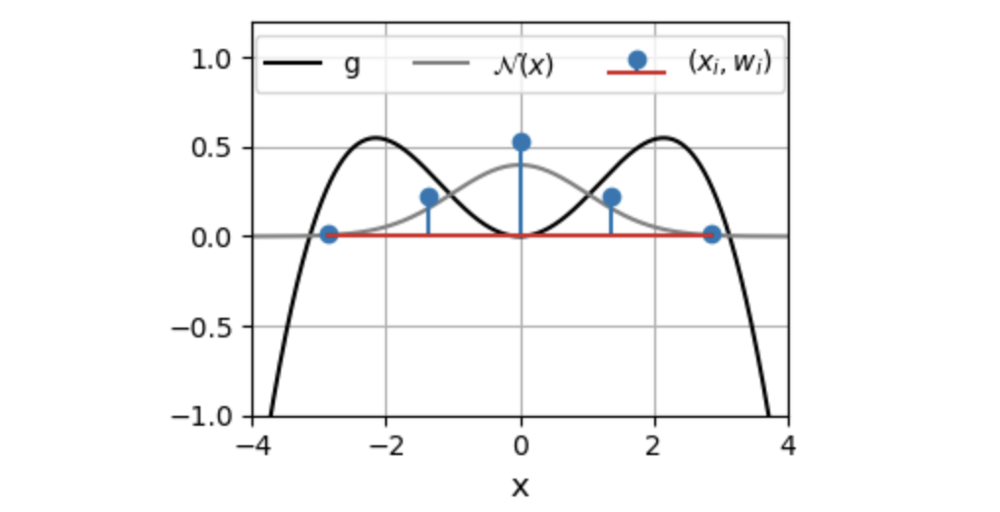
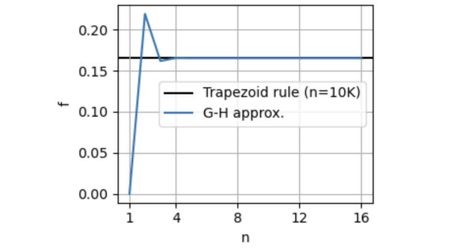

# Gauss-Hermite quadrature: an elegant parameterization for Gaussian integrals
**Rich Pang**

2026-01-22

Suppose we would like to numerically compute an intractable integral of the form

$$
f = \text{E}_{\mathcal{N}(x)}[g(x)] = \int_{-\infty}^{\infty} \mathcal{N}(x) g(x) dx,
$$
where $\mathcal{N}(x)$ is the standard normal distribution,
and we would furthermore like to cleanly parameterize how accurately we will do so.

By using Gauss-Hermite (GH) quadrature, we can compute this integral using $n$ function evaluations, $g(x_1), \dots, g(x_n)$, such that higher $n$ typically yields higher accuracy.
Specifically, GH quadrature tells us that we should compute
$$
f \approx \sum_{i=1}^n w_i g(x_i)
$$
where $x_i$ are the roots of the [physicist's Hermite polynomial](https://en.wikipedia.org/wiki/Hermite_polynomials) $H_n(x)$ and the weights are given by
$$
w_i = \frac{2^{n-1}n!\sqrt{\pi}}{n^2 H_{n-1}(x_i)^2}.
$$

## Example

Here we evaluate the integral for $g(x) = cos(x/2)(x/2)^2$. 
The plot below shows the roots of $H_n$ for $n=5$, and their associated weights.



As we can see, the G-H approximation is quite accurate even for low $n$.




## Comparison to other approaches

If we were to use the trapezoid rule, in addition to picking a resolution of our evaluation, we would have had to truncate the integration bounds, for instance from $-L$ to $L$, leaving us with another decision to make about how to choose $L$. GH quadrature is thus simpler, since the accuracy of the approximation is controlled only by the single parameter $n$.

Alternatively, we could have employed a Monte Carlo approach by sampling $n$ values $x_1 \dots x_n$ from $N(x)$, then approximating $f \approx \sum_i g(x_i)$. MC approaches, however, have the drawback of being nondeterministic — certain samples of $\{x_i\}$ might yield better approximations than others. GH, on the other hand, is purely deterministic.

## Python Code

The Python code for implementing GH quadrature is quite simple, since we can use numpy's `hermgauss` function:

```
import numpy as np
from numpy.polynomial.hermite import hermgauss

n = 16  # number of points
x_i, w_i = hermgauss(n)

def g(x):
    return np.cos(x/2)*(x/2)**2

# evaluate (note the additional square-root factors needed)
f = (1. / np.sqrt(np.pi)) * np.sum(w_i * g(np.sqrt(2.0) * x_i))
```

## Remark

GH quadrature is not necessarily optimal, and its accuracy will depend on $g$. For instance, if $g$ is a sum of $n$ delta functions, the optimal function evaluations should take place at the locations of the delta functions. In practice, however, it is often quite accurate for well-behaved $g$.

## Further reading

* [Wikipedia page](https://en.wikipedia.org/wiki/Gauss–Hermite_quadrature)
* [Multivariate Gauss-Hermite quadrature](http://www.jaeckel.org/ANoteOnMultivariateGaussHermiteQuadrature.pdf)